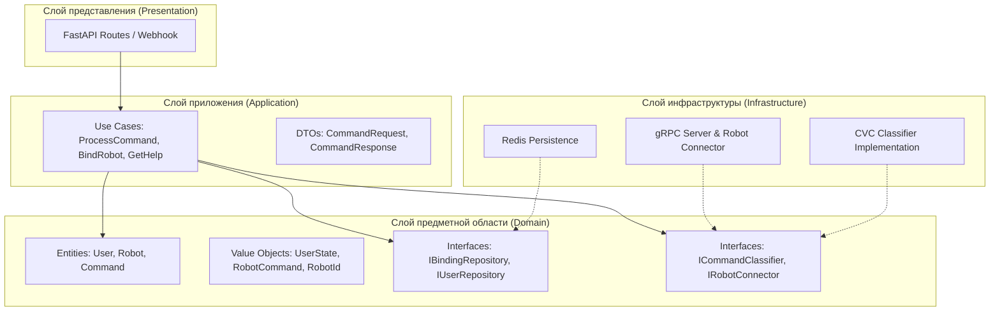

# RDS-2P-Salute - Управление роботом-пандой через Сбер Салют 🐼

Этот проект создан для работы с [SmartApp API от Сбера](https://developers.sber.ru/docs/ru/va/api/overview) и позволяет управлять роботом-пандой через голосовые команды в виртуальном ассистенте Сбер Салют.

## 🏗 Архитектура решения

Проект реализован на основе **Чистой архитектуры (Clean Architecture)**, что обеспечивает четкое разделение ответственности, легкость тестирования и независимость от внешних фреймворков.

### Схема архитектуры



### Описание слоев

1.  **Domain (Слой предметной области)**: Сердце приложения. Содержит бизнес-сущности (`User`, `Robot`), объекты-значения (`RobotCommand`) и интерфейсы (контракты) для доступа к данным и внешним сервисам. Не зависит ни от каких библиотек.
2.  **Application (Слой приложения)**: Содержит Use Cases (сценарии использования), которые реализуют бизнес-логику (например, процесс привязки или логику обработки команд). Использует DTO для передачи данных.
3.  **Infrastructure (Слой инфраструктуры)**: Реализация интерфейсов из Domain слоя. Здесь находится работа с Redis (хранение состояний и привязок), реализация gRPC сервера для подключения реальных роботов и клиент для CVC классификатора.
4.  **Presentation (Слой представления)**: FastAPI роуты, обрабатывающие входящие вебхуки от Сбера и преобразующие их в вызовы Use Cases.

---

## 🐼 Основные возможности

### 1. Система привязки роботов
Пользователь должен привязать робота перед управлением:
- **Запрос:** "Привяжи робота 1"
- **Верификация:** Система запрашивает 4-значный код у робота. Код отображается в логах робота.
- **Безопасность:** Код действует 5 минут, дается 3 попытки на ввод. Привязка сохраняется в Redis.

### 2. Умное управление (NLP)
Используется **CVC классификатор** для распознавания естественной речи:
- "Попроси панду лечь" -> команда `lie_down`
- "Вставай" -> команда `dismiss`
- "Дай лапу" -> команда `give_paw`

### 3. Интерактивная помощь
Многоуровневое меню помощи:
- При запросе "Помощь" предлагается выбор между "Служебными" и "Исполняемыми" командами.
- Состояние пользователя сохраняется, позволяя вести контекстный диалог (например, "расскажи про бегать").

### 4. gRPC Соединение
Роботы подключаются к серверу по протоколу gRPC и удерживают постоянное соединение (Stream), что позволяет отправлять команды мгновенно.

---

## 🛠 Технологический стек

- **FastAPI**: Современный и быстрый веб-фреймворк.
- **Redis**: Хранение постоянных привязок (User -> Robot) и временных состояний диалога.
- **gRPC**: Бинарный протокол для связи сервера с роботами.
- **CVC Classifier**: Внешний сервис для классификации намерений пользователя.
- **Mermaid**: Для визуализации архитектуры.

---

## 📁 Структура проекта

```
RDS-2P-Salute/
├── app/
│   ├── api/                # Презентационный слой: FastAPI роуты
│   ├── application/        # Слой приложения: Use Cases и DTO
│   │   ├── dto/            # Объекты переноса данных
│   │   └── use_cases/      # Сценарии бизнес-логики
│   ├── domain/             # Доменный слой: Сущности и интерфейсы
│   │   ├── entities/       # Бизнес-сущности (User, Robot)
│   │   ├── repositories/   # Интерфейсы репозиториев
│   │   ├── services/       # Интерфейсы внешних сервисов
│   │   └── value_objects/  # Объекты-значения (Enum, Validation)
│   ├── infrastructure/     # Инфраструктурный слой: Реализации
│   │   ├── config/         # Настройки приложения
│   │   ├── external/       # gRPC сервер, клиенты внешних API
│   │   └── persistence/    # Репозитории Redis
│   ├── utils/              # Общие утилиты (парсинг, билдеры ответов)
│   ├── main.py             # Точка входа в приложение
│   └── main_grpc.py        # Точка входа для gRPC сервера (отдельно)
├── config/                 # Конфигурационные файлы (robots.json)
├── grpc_proto/             # Protobuf определения для роботов
├── logs/                   # Логи приложения
├── requirements.txt        # Зависимости
└── docker-compose.yml      # Конфигурация Docker
```

---

## 🚀 Запуск

### Через Docker (Рекомендуется)
```bash
docker compose up -d
```
Сервер будет доступен на порту `20000` (внешний), gRPC на порту `50051`.

### Локально
1. Установите зависимости: `pip install -r requirements.txt`
2. Настройте Redis.
3. Запустите: `uvicorn app.main:app --host 0.0.0.0 --port 8000 --reload`

---

## 🔗 API Endpoints

- `POST /v1/webhook` - Основной вход для SmartApp API.
- `GET /health` - Проверка состояния сервера.
- `GET /docs` - Swagger документация.

---

## 🛡 Лицензия
Проект создан для образовательных и исследовательских целей в области робототехники и голосовых интерфейсов. 🐼🎖️
