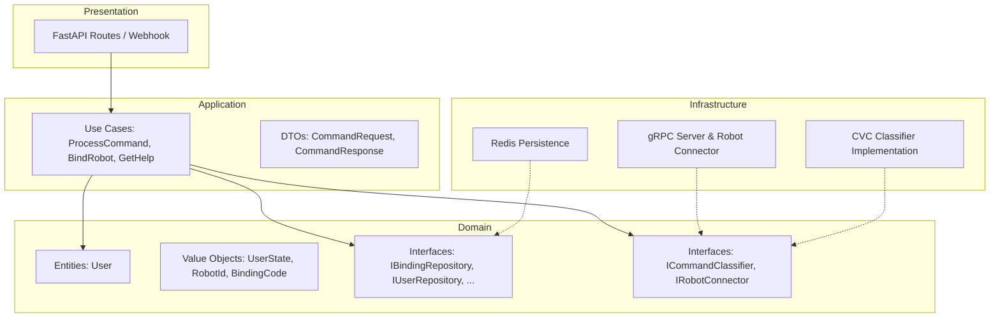

# RDS-2P-Salute

[](https://github.com/ShiWarai/RDS-2P-Salute/actions/workflows/tests.yml)
[](https://opensource.org/licenses/MIT)


Сервер веб-хуков для управления роботом-пандой через голосовые команды в виртуальном ассистенте Сбер Салют. Привязка пользователь ↔ робот, классификация намерений через CVC, доставка команд роботам по gRPC.

## Стек технологий

| Категория       | Технологии                                                                 |
| --------------- | --------------------------------------------------------------------------- |
| API             | FastAPI, Uvicorn                                                            |
| Данные          | Redis (привязки, состояния диалога)                                         |
| Роботы          | gRPC (Stream), Protobuf                                                     |
| NLP             | [CVC](https://github.com/ShiWarai/CVC) (внешний сервис классификации команд) |
| Архитектура     | Clean Architecture (Domain, Application, Infrastructure, Presentation)     |
| Инфраструктура  | Docker, Docker Compose                                                      |
| Разработка      | pytest, ruff, fakeredis                                                      |

## Оглавление

| Раздел | Содержание |
| ------ | ---------- |
| [Быстрый старт](#быстрый-старт) | Запуск за 3 шага (Docker) |
| [Установка и запуск](#установка-и-запуск) | Docker, fake_robot, тома Redis |
| [Возможности](#возможности) | Привязка, NLP, помощь, gRPC |
| [Архитектура](#архитектура) | Схема и описание слоёв |
| [API](#api) | Эндпоинты |
| [Структура проекта](#структура-проекта) | Дерево каталогов |
| [Тестирование](#тестирование) | Тесты, линт |
| [CI/CD](#cicd) | Пайплайн, публикация образа, ARM64 |
| [Лицензия](#лицензия) | Использование |

---

## Быстрый старт

1. Создайте `.env` из примера и задайте **`REDIS_PASSWORD`** (обязательно для `docker compose up`):
   ```bash
   cp .env.example .env
   # Отредактируйте REDIS_PASSWORD, например: openssl rand -hex 32
   ```
2. Соберите и запустите контейнеры:
   ```bash
   docker compose up -d
   ```
3. HTTP API: **http://localhost:20000**, gRPC: порт **50051**. Документация: http://localhost:20000/docs

Остановка: `docker compose down` (без `-v`, чтобы не удалять данные Redis).

---

## Установка и запуск

### Docker (рекомендуется)

- **Локальная разработка / сборка:** `docker compose up -d`. Сервисы: приложение (порты 20000, 50051), Redis.
- **Продакшен (образ из GHCR):** `docker compose -f docker-compose.yml -f docker-compose.prod.yml up -d`. Переопределяет только сервис `app` (образ из registry, без сборки). Предварительно: `docker pull ghcr.io/shiwarai/rds-2p-salute-app:main`.

### Тестирование без реального робота

В каталоге **fake_robot/** — имитатор робота (gRPC-клиент с `robot_id=0`). После `docker compose up -d` соберите и запустите контейнер имитатора: приложение будет считать робота подключённым, в консоли имитатора отображаются код привязки и команды. Подробно: [fake_robot/README.md](fake_robot/README.md).

### Почему могут пропадать привязки после перезапуска

Привязки хранятся в Redis в томе **redis_data**.

- В `docker-compose.yml` задано **`name: rds-2p-salute`**, поэтому том один и тот же с любого пути запуска.
- Redis пишет AOF в **`--dir /data`** (смонтированный том).
- Команда **`docker compose down -v`** удаляет тома — после следующего `up` Redis будет пустой. Для обычного перезапуска: `docker compose down && docker compose up --build -d`.

### Безопасность Redis

- **Порт 6379 наружу не публикуется** — приложение подключается к Redis только по внутренней сети Docker.
- Включён **`requirepass`**, пароль задаётся в `.env` как **`REDIS_PASSWORD`**; в `REDIS_URL` для сервиса `app` пароль подставляется автоматически.
- В логах приложения URL Redis выводится **без пароля** (маскировка).

После обновления с версии без пароля: положите `REDIS_PASSWORD` в `.env` и выполните `docker compose up -d` (при необходимости пересоздайте контейнер Redis). Старые данные в томе `redis_data` сохраняются; Redis при старте просто начнёт требовать пароль.

---

## Возможности

### Привязка роботов

- Запрос: «Привяжи робота 1». Система запрашивает 4-значный код у робота (код в логах робота). Код действует 5 минут, 3 попытки ввода. Привязка сохраняется в Redis.

### Управление по голосу (NLP)

Через **CVC** распознаются естественные фразы, например:

- «Попроси панду лечь» → `lie_down`
- «Вставай» → `dismiss`
- «Дай лапу» → `give_paw`

### Интерактивная помощь

- «Помощь» — выбор между служебными и исполняемыми командами. Состояние диалога сохраняется (например, «расскажи про бегать»).

### gRPC

Роботы подключаются по gRPC и держат Stream; команды доставляются мгновенно.

---

## Архитектура

Реализация в стиле **Clean Architecture**: домен не зависит от фреймворков, сценарии в Use Cases, инфраструктура подключается через интерфейсы.

### Схема



### Слои

- **Domain** — сущности (`User`), value objects (`UserState`, `RobotId`, `BindingCode`), интерфейсы репозиториев и сервисов. Без внешних зависимостей.
- **Application** — Use Cases и DTO; оркестрируют сценарии.
- **Infrastructure** — реализации: Redis, gRPC-сервер и коннектор к роботам, клиент CVC.
- **Presentation** — FastAPI-роуты, вебхуки Сбера → вызовы Use Cases.

---

## API

| Метод | Путь | Описание |
| ----- | ---- | -------- |
| POST | /v1/webhook | Вход для SmartApp API (Сбер Салют) |
| GET | /v1/health | Проверка состояния сервера |
| GET | /v1/admin/bindings | Список привязок пользователь → робот (ограничение доступа) |
| GET | /v1/admin/command-feedback | Репорты «исправить команду» (ограничение доступа) |
| GET | /docs | Swagger UI |

---

## Структура проекта

```
RDS-2P-Salute/
├── app/
│   ├── api/                # Роуты FastAPI
│   ├── application/        # Use Cases, DTO
│   ├── domain/             # Сущности, интерфейсы, value objects
│   ├── infrastructure/     # Redis, gRPC, CVC-клиент, конфиг
│   ├── utils/
│   └── main.py
├── fake_robot/             # Имитатор робота (gRPC, robot_id=0)
├── grpc_proto/             # Protobuf для роботов
├── tests/                  # unit, integration, mocks
├── docker-compose.yml
├── docker-compose.dev.yml  # Dev-образ (pytest, ruff)
├── Dockerfile
├── Dockerfile.dev
├── requirements.txt
├── requirements-dev.txt
├── pytest.ini
└── ruff.toml
```

---

## Тестирование

Используется образ **rds-2p-salute-dev** (docker-compose.dev.yml):

```bash
docker network create robot-services-network 2>/dev/null || true
docker compose -f docker-compose.yml build app
docker compose -f docker-compose.yml -f docker-compose.dev.yml build rds-2p-salute-dev

# Линт
docker compose -f docker-compose.yml -f docker-compose.dev.yml run --rm -T rds-2p-salute-dev ruff check .

# Unit- и интеграционные тесты
docker compose -f docker-compose.yml -f docker-compose.dev.yml run --rm -T rds-2p-salute-dev pytest tests/ -v --tb=short --cov=app --cov-report=term-missing
```

Тесты используют моки и fakeredis, без реального CVC и Redis.

---

## CI/CD

Пайплайны в `.github/workflows/`:

| Workflow | Триггер | Назначение |
| -------- | ------- | ---------- |
| **Tests** (`tests.yml`) | Push в `main` или `dev`, ручной запуск | Сборка образов app и dev, линт (ruff), pytest с покрытием, уведомления в Telegram при успехе/падении |
| **Publish** (`publish.yml`) | Завершение Tests на ветке `main` (только при успехе) | Сборка и публикация образа в GitHub Container Registry (GHCR) |

### Публикация образа

- Образ: `ghcr.io/shiwarai/rds-2p-salute-app:main` и по SHA коммита.
- Собирается для **linux/amd64** и **linux/arm64** (например, для Orange Pi 5).
- На сервере: `docker pull ghcr.io/shiwarai/rds-2p-salute-app:main`. После первого push в репозитории: **Packages** → `rds-2p-salute-app` → **Package settings** → **Change visibility** → **Public** (если нужен публичный доступ без логина).
- Уведомление в Telegram при успешной публикации (секреты `TELEGRAM_TOKEN`, `TELEGRAM_TO`).

---

## Лицензия

MIT

*Проект создан с использованием нейросетей.*